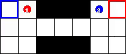
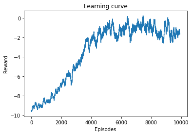

# Pytorch implementation of Counterfactual Multi Agent Policy Gradients

Paper: https://arxiv.org/abs/1705.08926

## Environment

The model was tested on the ma-gym Switch2-v0 environment (https://github.com/koulanurag/ma-gym/wiki/Environments#Switch)

## Results

Policy:

Learning Curve:

